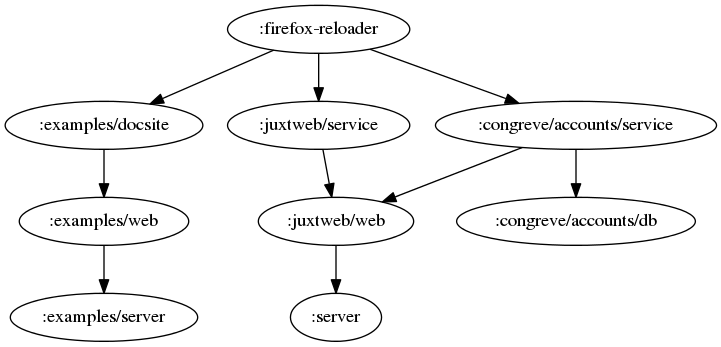

# Jig

> “Programming should be interactive, as beautiful as possible, modular, and it should generate assets that are easy to use and learn.” – [Michael O. Church](http://michaelochurch.wordpress.com/2013/08/07/why-clojure-will-win/)


Jig is an __application harness__ providing a beautifully interactive
development experience __for Clojure projects__.

## Releases and Dependency Information

[](https://clojars.org/jig)

## Features and benefits

Feedback is at the heart of all agile software development processes. If
you can reduce the time between making a change and seeing the result,
you can proceed faster, with more confidence and accuracy.

For the majority of developers, the impact of changing code cannot be
determined until the entire system has been re-built and
re-tested. While there are many advantages to frequent and thorough
testing, for developers the wait is long enough for us to lose our
concentration and focus.


Unless you have experienced a development environment that offers
_instant feedback upon change_ it is difficult to describe the impact it
can have on your ability to solve difficult problems, produce reliable
code quickly and make programming more enjoyable.

### Addressing Clojure's code reloading quirks

Clojure, in the tradition of dynamic languages, comes very close to
providing this kind of experience right out-of-the-box. In LISP,
functions are bound to vars, which can be rebound, and when functions
are applied, the latest binding of the function is used.

In practice, however, there are some minor quirks that impair the
dependability of the code reloading : adding a new library dependency,
redeclaring a `defmulti` or Clojure protocol, stale state referenced
in `def`s and `defonce`s are some examples. One of Jig's aims is
to handle these incidentals for you, letting you concentrate more fully
on your programming.

Jig builds upon Stuart Sierra's excellent
[reloaded workflow](http://thinkrelevance.com/blog/2013/06/04/clojure-workflow-reloaded)
pattern. Therefore it's important that you're familiar with the general
idea of this pattern: the developer invokes a 'reset' function at
various intervals which causes a minimalist reloading of just the code
that has changed since the last reset, and anything else that needs
reloading as a result (Due to the intricacies of Clojure and the JVM,
this is a non-trivial problem that Stuart has solved). Typically, the
reset function is bound to a hotkey, Emacs keybinding (I use "C-c r") or
[something](http://www.thegreenhead.com/2007/05/big-red-button-doomsday-device-usb-hub.php)
[more](http://www.dreamcheeky.com/big-red-button)
[exotic](http://www.stealthswitch2.com/products/stealthswitch-ii/). The
price of entry is that a developer has to ensure all application state
is held in a single map (or record) called the _system_. Otherwise the
pattern doesn't work but in practice this is a good architectural policy
to establish regardless.

Jig extends Stuart's work by providing some optional extra features that
can help in the development of large Clojure systems:

* modularity through componentisation
* configuration
* support for multiple projects
* a growing set of common re-usable infrastructure components.

### Modularity

Stuart describes the System Constructor which creates the initial
_state_ of a system. Jig provides an implementation of the System
Constructor that delegates the job of creating the system to components,
each component having the same lifecycle interface as Stuart describes:
`init`, `start` and `stop`. The System is created by
threading it through all the components.

A reset stops and restarts all components. Components are initialized
and started (in dependency order) and stopped (in reverse dependency
order) allowing for a clean shutdown of resources.

#### Why?

There are many good reasons for dividing your System into separate
components. One is that it gives you looser coupling between your
components, which can make it easier to re-use them (among other
benefits). Another is that it allows you flexibility and architectural
options at deploy time.

For example, you can deploy all your components in a single JVM for a
test environment, while in production you could distribute components
across multiple JVMs, for scaleability. If you are forced to deploy lots
of small JVMs, in all environments, this can be an inefficient use of
precious memory. I prefer to run a smaller number of JVMs, each with
more memory. Developing Clojure applications as monolithic systems works
well to begin with but can reduce flexibility down the road.

I want the option of deploying early versions of new projects quickly,
without the hassle of setting up a new server or incurring the cost of a
dedicated JVM (200Mb is not an insignificant overhead when you have
dozens of Clojure-based web applications). Jig lets me quickly hook up
new web applications and services onto an existing Clojure deployment.

Here's an example of one of my component graphs.



### Separation of dev-workflow from application code

Rather than using a lein template to generate the project and the
corresponding dev System, Jig separates these concerns. You can use
Jig's workflow to develop on existing projects that don't have a
built-in dev workflow.

You can also fork and improve Jig to your own requirements. The aim is
to retain
[internal re-prgrammability](http://martinfowler.com/bliki/InternalReprogrammability.html)
to your development tooling.

One Jig project can be used against many different projects, even
simultaneously (see Components)

I wrote Jig because I wanted to create new Clojure projects quickly
without having to maintain the development harness for each one. As I
make a small improvement to one development harness, I don't want the
hassle of going through all my other projects to update them in the same
way, but neither do I want dozens of development harnesses that differ
from each other. _I want one development harness, re-usable 'jig' that I can
use against multiple Leiningen-based projects._

### Configuration

Jig lets you specify configuration for your components in a single
configuration file. However, components can source their own
configuration if desired.

### Injection of the System into the web request context.

Jig does not have opinions as to how you should build your
applications. However, if does provide good support for writing
[Ring](https://github.com/ring-clojure) and
[Pedestal](http://pedestal.io) services should you wish to keep using
Jig in your deployment. More details can be found below.

### Automatic provision of url-for for URI generation

Pedestal boasts bidirectional routes, so that URIs can be generated from
route definitions rather than determined some other way. Jig provides a
`url-for` function in the Pedestal context, and defaults the
`app-name` and `request` to make it easy to generate paths that
make sense in the context of the page on which the link is placed.

### Portable web applications

It can be cost-effective for multiple web applications to share the same
JVM. Jig allows you to host web applications under contextual URI
prefixes. This is a feature made possible by the provision of the
`url-for` function, since 'portable' web applications can use this
to generate URIs for web links in their content, without resorting to
hard-coding URI paths.

### Component failure recovery

Errors thrown from components that fail during initialization or
start-up do not cause the entire system to fail. This reduces the number
of times that you have to reboot the JVM. Only components that are
successfully initialized are started, and only those that are
successfully started are stopped. Any failures are indicated in the
REPL, with full details and stack traces written to the log file..

## Usage

Normally you'll be used to creating with a project with `lein new`,
cd'ing to the newly created directory, perhaps adding some plugins to
its `project.clj` file, and running `lein`. Working with Jig is
different, in that you run `lein` from the Jig project directory and
'point' the configuration at one (or more) of your existing Leiningen
projects.

Clone the Jig repository as you would any other Clojure project.

    $ git clone https://github.com/juxt/jig

Configure Jig by copying in a config file into the
`config/config.edn`. You can skip this step if you want to see Jig
running in its default configuration which includes examples.

If you're using Emacs, load up Jig's `project.clj` and

    M-x nrepl-jack-in

(that's usually bound to 'Control-c, Meta-j')

In the `*nrepl*` buffer that (eventually) appears, type

    user> (go)

Alternatively, on the command line, type

    lein repl

and then

    user> (go)

Sync the application by calling `reset`

    user> (reset)

Resetting the application will cause namespaces to reload (thanks to
Stuart's work in `org.clojure/tools.namespace`) such that the
application will be back in sync with the code-base. This is the feature
that makes development fast and interactive, and it's all thanks to
Stuart's hard work.

You should find yourself typing `(reset)` rather a lot, and soon
even that becomes burdensome. Here's some Emacs code you can paste into
your `$HOME/.emacs.d/init.el` to provide a shortcut.

```clojure
(defun nrepl-reset ()
  (interactive)
  (save-some-buffers)
  (set-buffer "*nrepl*")
  (goto-char (point-max))
  (insert "(user/reset)")
  (nrepl-return))

(global-set-key (kbd "C-c r") 'nrepl-reset)
```

or, if you are using [cider]("http://github.com/clojure-emacs/cider"):

```clojure
(defun cider-repl-reset ()
  (interactive)
  (save-some-buffers)
  (with-current-buffer (cider-current-repl-buffer)
    (goto-char (point-max))
    (insert "(user/reset)")
    (cider-repl-return)))

(global-set-key (kbd "C-c r") 'cider-repl-reset)
```

After re-evaluating (or restarting Emacs) you'll be able to reset the
application using 'Control-c r'.

## Configuration

A configuration specifies :

* which components you want to include in your system
* where to find these components (the Leiningen project) and
* the configuration settings they will get

Usually you've have one configuration file per project per environment (e.g. dev, uat, prod).

By default, Jig looks for a `config/config.edn` file, but you can override this by placing a config file in `$HOME/.jig/config.edn` (where $HOME is your home directory). If a configuration file can't be found, a default will be used.

A configuration is a map which usually contains a `:jig/components` key listing the
components in a map (each key in the map is the component's label). You can get a good idea of the format by looking at the `config/default.edn` file.

### Includes

It's also possible to link to other configuration files, which are merged into a single config :

```clojure
{
 :jig/include ["/home/malcolm/src/octopus/config.clj" "/home/malcolm/src/juxtweb/config.clj"]
 }
```

### Formats

While `.edn` files are preferred, you can use `.clj` if you want
to evaluate Clojure expressions, such as calculations.

Important: To avoid injection attacks, never use the `.clj` suffix
for configuration you don't entirely control, including user submitted
configuration.

### Dealing with multiple diverging configurations

A very useful trick is to use Clojure's `#=` reader macro in the
`$HOME/.jig/config.clj` (you can't use an `.edn` file for this
trick). A useful pattern is to load in the default configuration and
make tweaks to it for the environment you're running Jig in. This helps
to prevent a proliferation of diveraging configuration files, which is a
common problem with multiple environments in any configuration
system. Each configuration can inherit from the defaults and use a
Clojure program to derive a modified version. What better language than
Clojure to tweak a map?

Here's an example.

```clojure
#=(eval
  (->
    ;; Start with the original configuration, stored in the git repo
    (clojure.core/read-string (slurp (str (System/getProperty "user.home") "/src/my-proj/config.clj")))

    ;; Add a 'private' component
    (assoc-in [:jig/components :firefox-reloader]
      {:jig/component 'jig.web.firefox-reload/Component
                  :jig/dependencies [:service :cljs-server]
                  :jig.web.firefox-reload/host "localhost"
                  :jig.web.firefox-reload/port 32000
                  })

    ;; Oh dear, some tricky path munging. We have to change lots of paths!
    ;; Let's walk the tree.
    ;; Due to symlinks not working well on Dropbox mounts,
    ;; replace all instances of relative paths with absolute ones
    ((partial clojure.walk/postwalk
      (fn [x]
        (if-let
          [path (and (string? x)
                     (second (re-matches #"\.\./my-proj(.*)" x)))]
                (str "/home/malcolm/another-path/src/my-proj" path)
                x))))))
```

## Components

You can write your own components by defining a type or record. At the
very least it needs to implement the `jig.Lifecycle` protocol.

```clojure
(:ns org.example.core
  (:import (jig Lifecycle)))

(deftype Component [config]
  Lifecycle
  (init [_ system] system)
  (start [_ system] system)
  (stop [_ system] system))
```

In Stuart's reloaded workflow, the `init` function is responsible
for creating the System. In Jig's component model, the system map is
threaded through each component's `init` function, giving it a
chance to add stuff. Likewise for the `start` and `stop`
functions. The minimum you need to do is return the original system, for
the next component in the chain.

Once you have declared your component, you need to reference it in the
config file `config/config.edn`. Jig needs to know which components
you want activated. If this file doesn't already exist, copy over the
contents from `config/sample.config.edn`. If you need to evaluate
Clojure expressions in your config, use a `.clj` suffix,
e.g. `config/config.clj`

For example...

```clojure
{:jig/components
  {:hello-app {:jig/component org.example.core/Component}}}
```

Components will be instantiated with a single argument: the component's
configuration value as specified in the config file. So if you want to
pass configuration to your component, an easy option is to add it to the
component's entry in the `config/config.edn` file.

If you want to see the state of the system at any time, it's available from the REPL

    user> system

It's nicer if you have pretty printing enabled at the REPL.

    M-x cust-var<RET>nrepl-use-pretty-printing

Alternatively, you can be explicit.

    user> (pprint system)

### Dependencies

Sometimes a component will rely on the existence of
another. Dependencies can be specified in the component configuration
under the `:jig/dependencies` key, where the value is a vector of
keys to other components in the configuration.

For example, let's suppose component Y is dependent on component X.

```clojure
{:jig/components
  {"X" {:jig/component org.example.core/X}
   "Y" {:jig/component org.example.core/Y
        :jig/dependencies ["X"]}}}
```

You can also view the component dependency graph from the REPL :-

    user> (graph)


### Persisting state across resets

There are some situations where you want state to survive across
resets. Values that are stored in the system anywhere under the
`:jig/safe` branch will not be purged. In the vast majority of cases
you should prefer state to be reinitialised on a reset.

### Built-in components

Jig comes with its own components, providing useful functionality and
demonstrate how components are written. Each component is
configurable. If you need a component which isn't in this list, I am
happy to provide it.

#### jig.web.ring/Jetty

Provides a Jetty service that can be used by Ring applications.

#### jig.web.ring/Compojure

Amalgamates Compojure routes contributed by other components into a single handler.

#### jig.git/GitPull

Pulls the latest code from a remote git repository. This can be useful
as part of an automatic continuous delivery mechanism.

#### jig.jmx/JmxMBean

Provides a reload capability, invokable as a JMX operation.

#### jig.web.stencil/StencilLoader

Clears out the [stencil](https://github.com/davidsantiago/stencil) cache to ensure stale Mustache templates do not survive a system reset.

#### jig.nginx/Purge

Purges an nginx reverse proxy to ensure cached pages do not survive a
system reset.

#### jig.nrepl/Server

Provides an nREPL server, useful if the system isn't started with
`lein repl` but an nREPL service is still desired.

#### jig.web.firefox-reload/Component

A trigger to get Firefox to reload the current page upon every
rest. Requires the
[Remote Control addon](https://addons.mozilla.org/en-US/firefox/addon/remote-control/))is
installed and enabled (the icon should be green).

#### jig.web.server/Component

Provides a Pedestal service on a Tomcat or Jetty listener, and ensures
that the System is made available to each Pedestal handler. This unifies
Stuart's approach with the Pedestal framework, allowing you to enjoy
Stuart's rapid development workflow while writing Pedestal services.

One of the major benefits of Pedestal over Ring is the support for
bi-directionality between routes and handlers. For me, this is a
stand-out feature because of the importance of hyperlinks, both in web
pages and RESTful web applications.

Asking the library to generate URLs for you, rather than hard-coding
them in your application, reduces the risk of broken links and
maintenance cost. Jig injects a useful function into the Pedestal
context, under the `:url-for` key, that lets you generate URLs
relative to request you are processing. By default, URLs are generated
to handler within the same application, but you can specify
`:app-name` to target other applications hosted in the same JVM.

Look at the use of `url-for` in the example below. See how _easy_ it
is to generate URLs to target other Pedestal handlers. Nice.

```clojure
(defhandler my-index-page [request]
  {:status 200
   :headers {"Content-Type" "text/plain"}
   :body "Hello World!})

(defbefore my-root-page [{:keys [url-for] :as context}]
  (assoc context :response
    (ring.util.response/redirect
      ;; Look, no nasty hard-coded URLs!
      (url-for ::my-index-page))))
```

#### jig.web.app/Component

Provides a web application abstraction on top of
`jig.web.server/Component`. Other components can add Pedestal routes
to a web application component. These are then combined to form a
complete Pedestal route table.

Applications can share the same `jig.web.server/Component`, allowing
for 'virtual hosts'. Applications can specify a different host, scheme
or be rooted at a sub-context. This are really useful for hosting
different Clojure-powered websites on the same JVM.

These examples assume a little knowledge about Pedestal, see
http://pedestal.io/documentation/service-routing/ for more details.

#### jig.cljs/Builder

Adding a step to compile ClojureScript on every reset can be
accomplished with this component.

```clojure
:cljs-builder
{:jig/component jig.cljs/Builder
 :jig/project "../myproj/project.clj"
 :output-dir "../myproj/target/js"
 :output-to "../myproj/target/js/main.js"
 :source-map "../myproj/target/js/main.js.map"
 :optimizations :none
 :clean-build false
 }
```

Setting `:clean-build` to true will cause the output directory to be
deleted on every reset, otherwise an incremental build will be
performed. The compiler environment is stored under the `:jig/safe`
branch to make incremental builds possible. Incremental builds are a lot
faster and are therefore enabled by default.

You may want to configure different builder components for different
pages, or for different optimizations. Multiple builds can be achieved
by adding multiple instances of this component to your configuration.

#### jig.cljs/FileServer

Once the JavaScript and source-map files have been generated, it is
often useful to be able to serve it from a web server. A minimum of two
dependencies must be specified, one should be a `jig.cljs/Builder`
component instance, the other should be the a
`jig.web.app/Component` component instance. A web context should be
specified, under which resources will be available.

```clojure
:cljs-server
{:jig/component jig.cljs/FileServer
 :jig/dependencies [:cljs-builder :web]
 :jig.web/context "/js"
}
```

## Projects

You point Jig at your own projects by specifying a `:jig/project`
configuration entry which specifies the project containing the component you wish to include.

```clojure
:juxtweb/service {:jig/component pro.juxt.website.core/Component
                  :jig/dependencies [:juxtweb/web]
                  :jig.web/app-name :juxtweb/web
                  :jig/project "../juxtweb/project.clj"}
```

Leiningen dependencies that are added to a project during development
are automatically can be added to the classpath, so you don't have to
restart the JVM if you are simply adding a dependency to a project.

## Deployment

You can run Jig in production the same way as you run in development. If
you are using a single project which depends on Jig (or at least one Jig
extension) you can uberjar your project.

### uberjar

Create a main.clj or other similar namespace with the following content.

```clojure
(ns main (:gen-class))

(defn -main [& args] (user/go))
```

In your project.clj, add the following

```clojure
:main main :aot [main]
```

Or see https://github.com/mastodonc/kixi.hecuba for an example of a
project which deploys this way.

## Caveats

### The Lifecycle protocol

I don't see any reason why others couldn't create their own 'jigs' (a
jig is a separate Leiningen project after all). Although this project is
named eponymously, there can be others customized for specialist
contexts (either new projects, or forks of this one).

If that happens and there's a need to share components between jigs (for
reasons of component portability) then it will make sense to promote the
`Lifecycle` protocol (and maybe others) to a common library that
different jigs can use.

#### EDN data readers

If an external project depends on a third-party jar which isn't on Jig's
own classpath, then it will not have been visible to Clojure when
clojure.core is first loaded. This means that any data readers declared
in `/data_readers.clj` will not work. If you use the
`edn/read-string` in these projects you cannot assume the
`*data-readers*` dynamic var will contain the data readers declared
in the third-party jar. The workaround is to use the 2-arg form of
edn/read edn/read-string and supply the readers explicitly in the option
map.

For example, when loading Datomic data from a file, you would use the
following form :

```clojure
(edn/read-string
   {:readers {'db/id datomic.db/id-literal
              'db/fn datomic.function/construct
              'base64 datomic.codec/base-64-literal}}
   "my-data.edn")
```

### user.clj

If a project has a `/user.clj` file in one of its source
directories, then it will be loaded on a reset and override Jig's user
namespace. Jig will then stop working. The current workaround is to
ensure such a file isn't visible to Jig, either by renaming it or by
removing the source directory containing it in the project's
`project.clj` file. It is hoped that future versions of Jig will
avoid this issue by disabling the loading of such files by `tools.namespace`.

## FAQ

> Clojure already does code reloading! Why do I need all this stuff?

Clojure, being a LISP, allows you to reload functions at will. But
Stuart's pattern (which Jig builds on) extends this to state,
compile-time macros, protocols/types/records and
multi-methods. Experienced Clojure developers know when to reload some
namespaces and when to restart the JVM. It seems better to raise the
abstraction so you don't have to think about these technicalities all
the time, just 'reset' each time you want consistency while you develop.

See this comment for a better explanation: https://news.ycombinator.com/item?id=5819912

Jig is trying to provide you with a better development experience, while
nudging you towards a modular architecture that will help you when your
system grows to a certain size.

> Where can I find examples of projects using Jig?

[Mastodon C](http://www.mastodonc.com/)'s
[Hecuba](https://github.com/mastodonc/kixi.hecuba) project uses Jig for
development, deploying using lein uberjar.

[JUXT Accounting](https://github.com/juxt/juxt-accounting) is a full application that is developed with Jig 1.0.x.

JUXT's [website](https://juxt.pro) also [uses](https://github.com/juxt/juxtweb) Jig 1.0.x, for both development and deployment.

> What's the relationship between Jig and Up?

[Up](https://github.com/malcolmsparks/up) is deprecated, Jig replaces it
(and has stolen all the worthy bits).

The main difference between Up and Jig is that Up added config to the
Leiningen project and the dependency relation between projects and
infrastructure has been reversed. In due course Jig will add a protocol
that components can extend to communicate with other components over a
System bus (core.async channel), and will then provide a superset of
Up's functionality. Jig is better.

## Troubleshooting

### Look at the system

Don't forget the system is available in the REPL, as `user/system`. That's useful for testing what functions are returning.

You can check what's in the system by outputting it to the
console. `(keys user/system)` is often useful if the system gets
very large and you need to navigate it.

### Log files

By default, Jig configures logback and logs are written to
`$HOME/.jig/logs`. Events such as component init, startup and
shutdown, and exceptions that occur during these phases, are written to
here. When the REPL tells you to check the log files, this is where you
should look.

### Common errors in a component's init, start and stop functions

You should return the system value, modified if necessary, from each
component function. If you don't return any value, Jig will detect this
and throw an error.

Make sure that you do modify the system, but then return using the
symbol representing the unmodified system. That's a common mistake. Jig
won't detect that you have returned the same system it gave you, because
that's normal behaviour.

### 'No implementation of method' when compiling components

>  java.lang.IllegalArgumentException: No implementation of method: :init of protocol: #'jig/Lifecycle found for class

Ensure you `require` jig before `import`ing the `jig/Lifecycle` protocol.

## Console

By default, a console is provided at http://localhost:8001.

Currently this supports the following (limited) functionality:

* This README
* A system map browser
* Dynamically served [Codox](https://github.com/weavejester/codox) API documentation
* A list of TODOs
* Triggering a reload

Security advisory: Since this console allows remote reloads, ensure that
you disable this console if you are intending to run production
applications on Jig, or secure access to whatever port you run it on.

## Examples

### Sudoku

Many people have asked for a demonstration of how to configure a simple
Ring application. This is provided as a Sudoku example in the
`examples/` directory. It is incorporated in the default
configuration and the website is accessible at http://localhost:8091/sudoku.html

### MQTT broker

This is a network service built on Netty. It shows how easy it is to use
Java service libraries directly using only Clojure and Jig. Please refer
to the README.md in examples/mqtt-broker for more details.

## Copyright and License

Copyright © 2013 JUXT. All rights reserved.

The use and distribution terms for this software are covered by the
[Eclipse Public License 1.0] which can be found in the file epl-v10.html
at the root of this distribution. By using this software in any fashion,
you are agreeing to be bound by the terms of this license. You must not
remove this notice, or any other, from this software.

[Eclipse Public License 1.0]: http://opensource.org/licenses/eclipse-1.0.php
